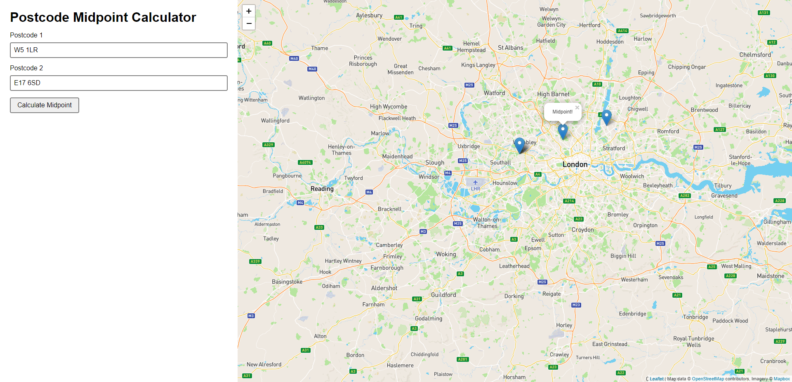

# Postcode Midpoint Calculator


## About this Project

Input a list of postcodes at it will tell you where the midpoint is on a map.



### Built with

- Vue CLI
- Leaflet (OpenStreetMap)
- Mapbox (OSM layer style)
- Postcodes.io (geocoding)

## Getting Started

### Prerequisites

- Node

### Installation

1. Install the dependencies.

```
npm i
```

2. Create a secrets config file `src/assets/secrets.json` with the following content:

```
{
  "mapboxToken": "..."
}
```

3. Run the app locally with hot reloading.

```
npm run dev
```

Go to http://localhost:8080

## Roadmap

No planned features

## Release History

- v0.1.0
  - Initial design
